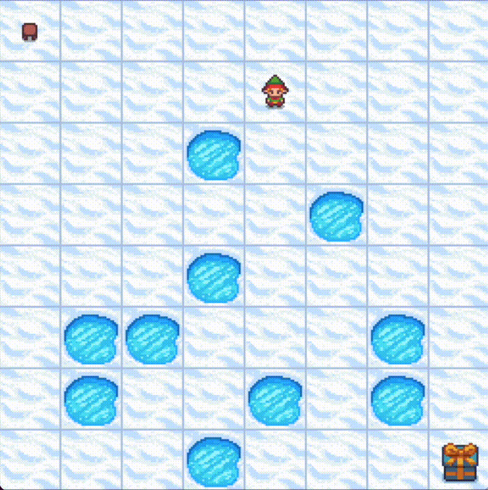
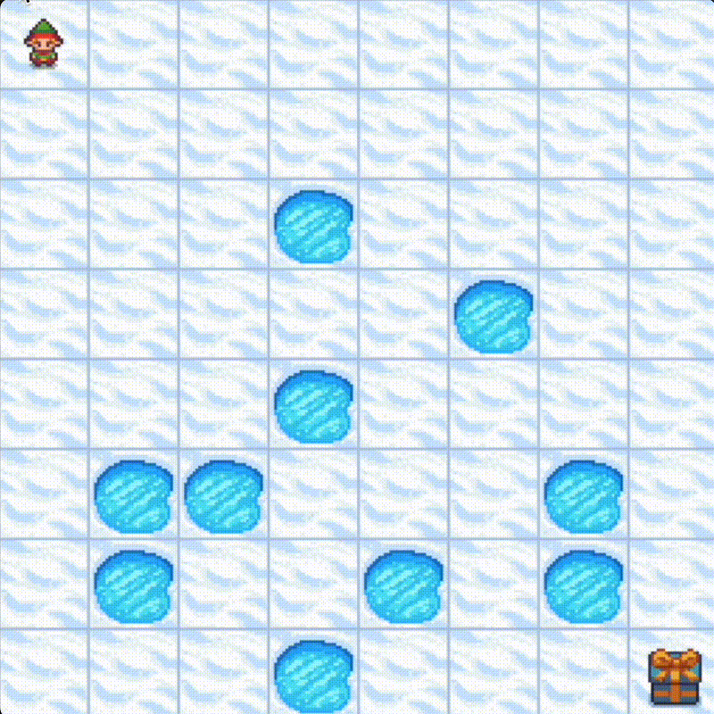
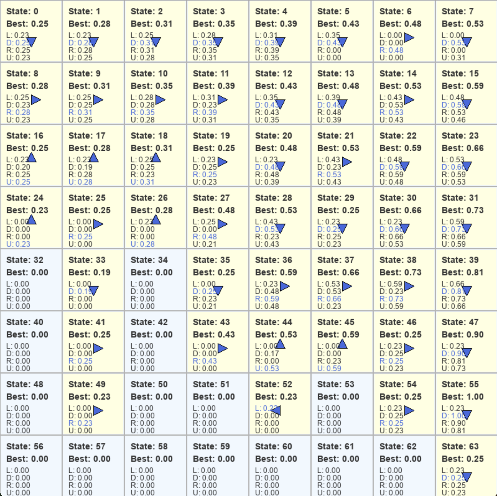
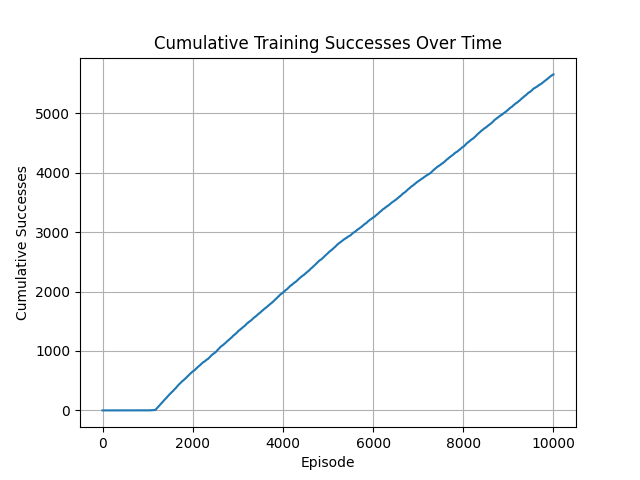
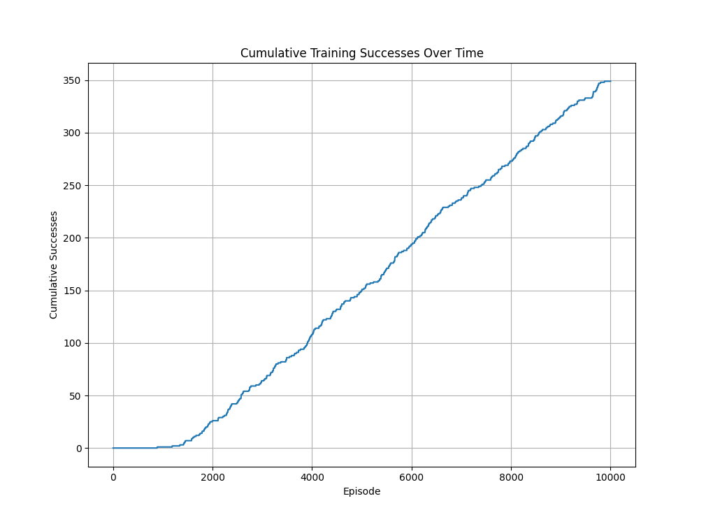
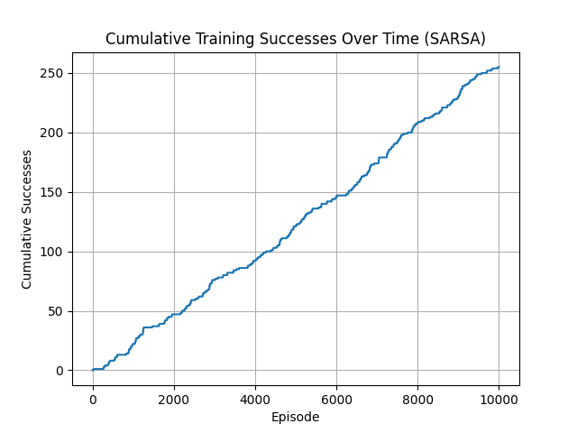
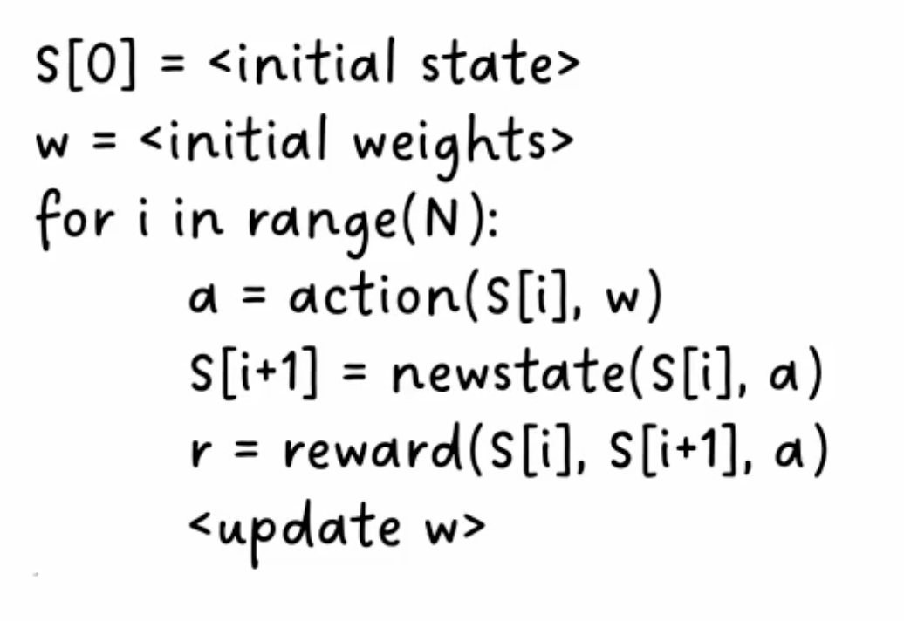

# 🎯 Reinforcement Learning Case Study with Gymnasium

## 🚀 Project Overview & Results

To deepen my understanding of reinforcement learning, I implemented and compared some RL algorithms from scratch to solve the "Frozen Lake" environment from [Gymnasium](https://gymnasium.farama.org/environments/toy_text/frozen_lake/#description). This project was done to implement something with the theoretical skills i have obtained within reinforcement learning at UiO, and also because it was quite fun🥸

**Key Results:**
- 🤖 **Q-learning from scratch**: Built complete RL methids without external libraries
- 🎲 **Algorithm comparison**: Implemented and analyzed Q-learning vs. SARSA performance
- 📊 **Stochastic environment mastery**: Handled the same game with both random and non-random movement mechanics


## 📈 Learning Process & Results

### Random Exploration → Optimal Policy
The learning journey from chaotic exploration to strategic execution represents the core of reinforcement learning. The little guy on screen has through around 1000 session of trial and error, found out how to go from start to end in a perfect manner.

<div align="center">
  
  
  <p><em>Left: Initial random exploration | Right: Learned optimal policy execution</em></p>
</div>

### Q-Table Analysis
<div align="center">
  
  <p><em>Q-table visualization showing learned state-action values and policy directions</em></p>
</div>

## 🎲 Advanced Challenge: Stochastic Environments

**Problem Complexity:** Introduced 66% action randomness (`is_slippery=True`) to simulate real-world uncertainty where intended actions fail 2/3 of the time. In the slippery mode, when an agent attempts to move in a direction, there's only a 33% chance it will actually move in that intended direction - the remaining 66% of the time, it will randomly move perpendicular to the intended direction.

For example, if action is left and is_slippery is True, then:

P(move left)=1/3

P(move up)=1/3

P(move down)=1/3


### Comparative Analysis: Q-Learning vs. SARSA
<div align="center">
  
  
  <p><em>Left: Q-learning in deterministic environment (6000/10000 successes) | Right: Q-learning in stochastic environment (350/10000 successes)</em></p>
</div>

**Key Insight:** Tested hypothesis that on-policy SARSA would outperform off-policy Q-learning in high-uncertainty environments:

<div align="center">
  
  <p><em>SARSA results: Contrary to theory, performed worse than Q-learning in this high-randomness scenario</em></p>
</div>

**Analysis:** The extreme randomness level (66%) appears to exceed the threshold where traditional policy differences matter, suggesting the need for more sophisticated approaches in highly stochastic environments.

## 🔧 How is this done?

This project implements reinforcement learning from the ground up, focusing on temporal difference learning methods to solve the Frozen Lake environment.

<div align="center">
  
  <p><em>Core RL cycle: From my professor at UiO</em></p>
</div>


## ⚙️ Technical Setup

### Installation
```bash
git clone <repository-url>
cd Reinforcement-Learning
python -m venv venv
source venv/bin/activate 
pip install -r requirements.txt
```

---

<div align="center">
  <p>Built with a ❤️ for procrastinating exam prep</p>
</div>
